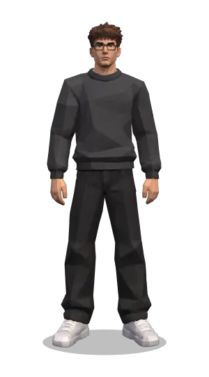
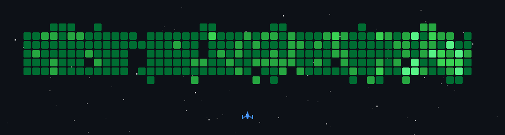

**I'm a Fullstack developer, currently working with React & Go!**

🌍 &nbsp;I'm based in Brazil, Rio Grande do Sul 
💻 &nbsp;See my portfolio at [matheusdias.dev](https://matheusdias.dev?utm_source=github) 
✉️ &nbsp;You can contact me at [matheus.foscarinid@gmail.com](mailto:matheus.foscarinid@gmail.com) 
🧠 &nbsp;I'm currently reading books about Software Architecture and System design 
👨‍🏫 &nbsp;I like to talk about starting on the technology market 
💬 &nbsp;Ask me anything! I'll love to help you!

 

 

